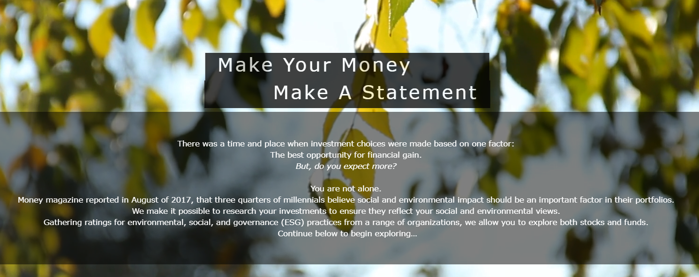

## Project: Socially Responsible Investments Reporting - Make Your Money, Make a Statement
## Data Science w209. Data Visualization, Fall 2017 (Section 4)

### University of California, Berkeley
### School of Information
### Master of Information and Data Science (MIDS)

**Under the Guidance of**: Professor John Alexis Guerra Gomez

**Authors**:
* [Melanie Costello](https://www.ischool.berkeley.edu/people/melanie-costello) // chenglin_liu@berkeley.edu
* [Chenglin Liu](https://www.ischool.berkeley.edu/people/chenglin-liu/) // melanie.costello@berkeley.edu
* [Adrea Pope](https://www.ischool.berkeley.edu/people/andrea-pope) // andreapope@berkeley.edu

#### Important Links:
* Website: http://people.ischool.berkeley.edu/~cliu/
* Demo Video: https://www.youtube.com/watch?v=3njaco5nOuo&feature=youtu.be

#### About:
This data visualization project for MIDS W209 brings together disparate data sources to create a more comprehensive view of the environmental, social and governance practices of publicly traded companies and investment funds.

The purpose is to educate users on the basics of socially responsible investing, to allow them to investigate different evaluation metrics like carbon emissions and human rights, and to enable them to explore and answer their own questions about specific stocks or funds.

